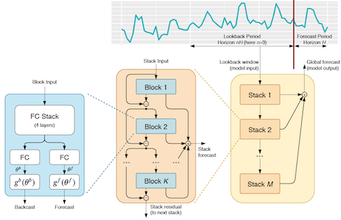

# N-BEATS

N-BEATS is a neural-network based model for univariate timeseries forecasting.



#### Results
The `notebooks` directory contains a notebook per experiment with the final scores. 
We also included the results for 10 times smaller ensembles, 
you can see that the difference is not significant.
Note: This is a "lighter" version of original N-BEATS which performs slightly different, 
sometimes better sometimes worse but overall on the same SOTA level.
 
## Citation

If you use N-BEATS in any context, please cite the following paper:

```
@inproceedings{
  Oreshkin2020:N-BEATS,
  title={{N-BEATS}: Neural basis expansion analysis for interpretable time series forecasting},
  author={Boris N. Oreshkin and Dmitri Carpov and Nicolas Chapados and Yoshua Bengio},
  booktitle={International Conference on Learning Representations},
  year={2020},
  url={https://openreview.net/forum?id=r1ecqn4YwB}
}
```

This is a collaborative work between [Element AI](https://www.elementai.com) and [Mila](https://www.mila.quebec).
Please cite the paper if you use this model or the code.
